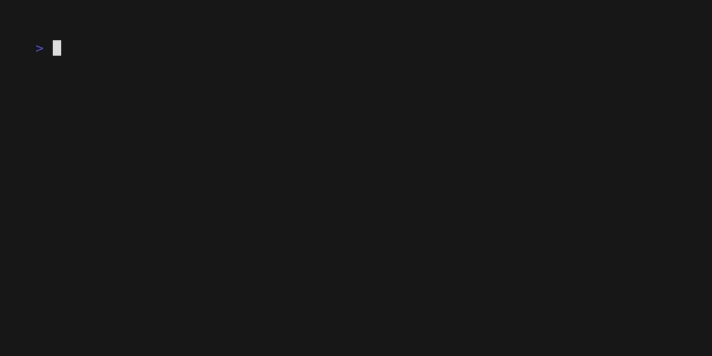

# talks
A repository for all the talks

## Index

## How to build slides

To build slide deck from the talks, you have to clone the repo.

## Cloning the repo

```shell
git clone git@github.com:sarvsav/talks.git
```

run the following command in the terminal to install the slides.

### Installing slides

You must have go > 1.16 installed in your system.

```shell
go install github.com/maaslalani/slides@latest
```

### Viewing slides

Just give the path to `main.md` from the talk. Example,

```shell
slides golang_dorset_15_04_24/main.md
```



## Star the repo

🌟 **Liked the project? Consider giving it a star!** 🌟

If you found this repository helpful or valuable, please consider showing your support by starring it on GitHub. Your stars help others discover and benefit from the project too. Thank you!
